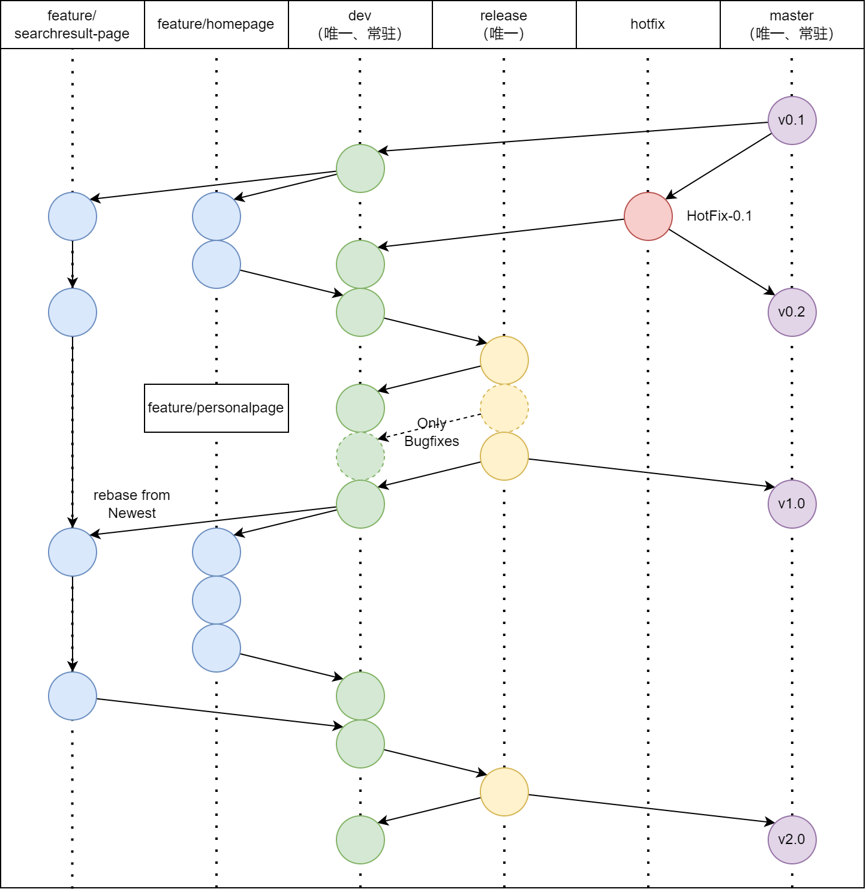

# Akashic平台 项目贡献指南

本文档将向您讲解如何为Akashic项目提交优秀的issue/commit，请您耐心阅读。

**注意：不符合指南中规范的issue/commit可能不会被受理**

## 目录
- [Akashic平台 项目贡献指南](#akashic平台-项目贡献指南)
  - [目录](#目录)
  - [提交 issue](#提交-issue)
    - [答疑交流 Usage](#答疑交流-usage)
    - [反馈缺陷 Bug](#反馈缺陷-bug)
    - [提交新需求 Feature Request](#提交新需求-feature-request)
  - [提交 commit](#提交-commit)
    - [页眉](#页眉)
      - [提交类型](#提交类型)
      - [作用域](#作用域)
      - [主题](#主题)
    - [正文](#正文)
    - [脚注](#脚注)
      - [不兼容修改](#不兼容修改)
      - [解决了的issue](#解决了的issue)

## 提交 issue

Issue 是一种非常好的可沉淀的交流方式，可跟踪，可复现。

我们使用 GitHub Issue 来与社区交流，它有几种应用场景：

- 答疑交流
- 反馈Bug
- 提交新需求

### 答疑交流 Usage

项目尚未正式上线，上线后可能会提供以下交流渠道：

- QQ群
- 微信群
- telegram频道

但考虑到Issue可沉淀的特性，我们决定保留其答疑交流的用途。但在提出使用问题之前，请再三确认你的问题确实值得被提出来。问题的范畴也应适当限制，以免造成不必要的打扰。

### 反馈缺陷 Bug

恭喜，发现一个 Bug 意味着我们的应用又少了一个缺陷，快速 Fix 掉即可。

但为了尽可能的减少沟通成本，高效的解决问题，我们期望你能仔细阅读：

[『如何向开源项目提交无法解答的问题』](https://zhuanlan.zhihu.com/p/25795393)
[『记录一些常见的沟通问题』](https://github.com/atian25/blog/issues/29)


**注意：各子项目可能有自己的Bug反馈模板，具体请阅读对应子项目的贡献指南。本文档仅做引导说明**

然后期望你能提供：Bug的复现步骤，错误日志以及相关配置，请务必按照 Issue 模板填写相关条目，避免挤牙膏式交流。

- **Eviroment**:
- **Akashic Version**:
- **Platform**:
- **Mini Showcase Repository**:

绝大部分情况下，在这个过程中你就会自己发现问题了，这是一种非常高效的问题定位方式：

- 如果发现是使用错误，不是 Bug，请及时关闭 issue，并把解决方式同步进来，方便后来人。
- 如果发现是小问题（文档错别字修改，小的 bug fix），欢迎直接参与进来，直接提 PR 优化。
- 如果还不能解决，此时直接上传最小可复现仓库到你的 GitHub ，我们会快速跟进。

BTW：学习 [Markdown](https://guides.github.com/features/mastering-markdown/) 语法，贴长段代码用三个 ```

### 提交新需求 Feature Request

我们推荐通过 RFC (Request for Comments) 的方式来讨论和实现一个新的特性。

Egg团队称之为：『基于 GitHub 的硬盘式异步协作模式』

通过 issue 发起 RFC 提案 -> 讨论定稿 -> 提交 Pull Request -> Code Review -> 发布。

这样便于沉淀，即使是当时没有参与讨论的开发者，事后也能通过 issue 了解某个功能设计的前因后果。

它的模板如下：

> ## 背景
> 
> - 描述你希望解决的问题的现状
> - 附上相关的 issue 地址
> 
> ## 思路
> 
> 描述大概的解决思路，可以包含 API 设计和伪代码等
> 
> ## 跟进
> 
> 后续编辑，附上对应的 Pull Request 地址，可以用 `- [ ] some task` 的方式。

其他约束：

> 标题：[RFC] some title
> 
> 标签：type: proposals

## 提交 commit

这里的commit包括Submit和Pull Request

> 首先介绍一下本项目使用的branch命名规范：
> 
> |分支|命名|说明|
> | :--- | :---: | :--- |
> |主分支|master|（常驻且唯一）主分支，所有提供给用户使用的正式版本，都在这个主分支上发布|
> |开发分支|dev|（常驻且唯一）开发分支，永远是功能最新最全的分支|
> |功能分支|feature/*|新功能分支，某个功能正在开发阶段|
> |发布版本|release-*|（唯一，但版本号不同）预发布近期要上线的功能|
> |修复分支|hotfix/*|对已发布代码的bug进行修复|
> 
> 其中，除了feature和hotfix分支的代码**不一定**能构建运行以外，其它分支的代码**一定**是能够构建运行并投入生产环境的代码。
> 
> 各分支间迭代如下图所示：
> 

项目使用Angular提出的[Angular提交信息规范](Angular提交信息规范)

简明扼要的，Angular规范中规定提交格式如下：

```
<type>(<scope>): <subject>
<BLANK LINE>
<body>
<BLANK LINE>
<footer>
```

每次提交可以包含页眉(header)、正文(body)和页脚(footer)，每次提交必须包含页眉内容

每次提交的信息不超过100个字符

### 页眉

页眉的格式指定为提交类型(type)、作用域(scope，可选)和主题(subject)

#### 提交类型

提交类型指定为下面其中一个：

- build：对构建系统或者外部依赖项进行了修改
- ci：对CI配置文件或脚本进行了修改
- docs：对文档进行了修改
- feat：增加新的特征
- fix：修复bug
- pref：提高性能的代码更改
- refactor：既不是修复bug也不是添加特征的代码重构
- style：不影响代码含义的修改，比如空格、格式化、缺失的分号等
- test：增加确实的测试或者矫正已存在的测试

#### 作用域

范围可以是任何指定提交更改位置的内容，详细可参考各子项目的项目结构

#### 主题

主题包括了对本次修改的简洁描述，有以下准则：

- 使用命令式，现在时态：“改变”不是“已改变”也不是“改变了”
- 不要大写首字母
- 不在末尾添加句号

### 正文
和主题设置类似，使用命令式、现在时态

应该包含修改的动机以及和之前行为的对比

### 脚注

脚注中应当包含`Breaking changes`和`Issues to close`

#### 不兼容修改

不兼容修改指的是本次提交修改了不兼容之前版本的API或者环境变量

所有不兼容修改都必须在页脚中作为中断更改块提到，以BREAKING CHANGE:开头，后跟一个空格或者两个换行符，其余的信息就是对此次修改的描述，修改的理由和修改注释

#### 解决了的issue

如果本次提交目的是解决issue的话，需要在页脚引用该issue

以关键字Closes开头，如果修改了多个bug则以逗号隔开